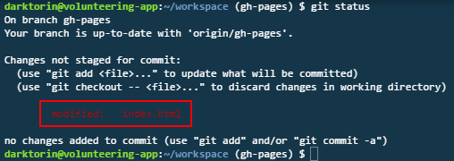
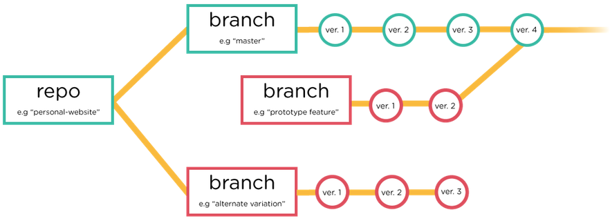
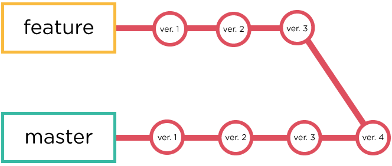

# Documentation

This is a documentation of keywords used throughout Cipher's guides. It contains explanations, examples, and practice exercises.

Practice exercises are meant to test your new found power after completing a guide. Run through them to nail concepts.

## Table of Contents

1. [Workspace Setup](#workspace-setup)
  - [Cloud 9](#cloud-9-c9)
  - [GitHub](#)
  - [Version Control System (VCS)](#version-control-system-vcs)
  - [Repository](#repository)
  - [Branch](#branch)
  - [Integrated Development Environment](#integrated-development-environment-ide)
  - [Markdown](#markdown)

2. [Personal Website](#personal-website)
  - [HTML](#html)
  - [CSS](#css)

# Workspace Setup

By the end of this [guide](workspace_setup/README.md), we will have be taken through the setup process of our workspace!

## Cloud 9 (C9)

[Cloud 9](https://c9.io) is a website; the short form of Cloud 9 is C9. 

### Explanation

C9 is an online text editor that has tools to help you code more efficiently. The technical term for this is [integrated development environment (IDE)](#integrated-development-environment-ide).

What makes C9 great is that it enables you to start programming with just the internet and a browser. No installing software required!

### Analogy

Just like how [Google Drive](https://drive.google.com) allows us to write and organize documents written in English, we can use C9 to write, save, and organize code.

## GitHub

[GitHub](https://github.com) is an Internet company (website) that was founded on February 8, 2008.

### Explanation

GitHub leverages [Git](https://git-scm.com/), a [version control system](../DOCUMENTATION.md#version-control-system-vcs), to post our content online. 

With our content online, GitHub uses a service called "GitHub Pages" to  enable the creation of custom web addresses/URLs for our projects. These will be sharable with friends and family!

Example: https://nguyenbrian.github.io

### More Technical Explanation:

[GitHub](https://github.com/) is a [repository](../DOCUMENTATION.md#repository) hosting service. It provides a friendly way to manage [repositories](../DOCUMENTATION.md#repository) and [branches](../DOCUMENTATION.md#branch) with an organized interface.

## Version Control System (VCS)

There are many _VCSs_, However, [Git](https://git-scm.com/) is the mostly widely used. [GitHub](https://github.com) plays a role in popularity. It has [this very cute mascot](http://spinnakr.com/blog/wp-content/uploads/2013/02/Original-Octocat.jpg).

### Explanation

A VCS tracks and manages changes to our code.



Git has tools to show that it has detected a change in the file. Changes consist of anything we've added or removed from the file.

Git also allows us to save the same files at different points in time. This enables us to look at our document's history from start to finish.

If we make a mistake and it seems irreversible, we are capable of selecting a version of the file from back in time.

### Example

Let's say we are using Git with a Microsoft Word document.

We have a file named story.doc.

We write for 5 hours and save each hour.

Typically, each time we save, we would overwrite our document. Though, with Git, it would create another version of the file in that point of time.

- Git hides these other versions so your folder doesn't get messy, but we can call on the others if need be.
  - Git treats every version of code as a "snapshot" that we can look back/
  revert to at anytime.

## Repository

The short form is _"repo"_ and is widely used. Coders don't have time for six extra letters.

### Explanation

A repo is where project folders are stored. It can be compared to a master folder.

It marks the beginning of the hierarchy. The repo never has a file within its first step. Rather, there is a subfolder called a branch that encloses files.


### Example

[Cipher's collection of content](https://github.com/projectcipher/cipher) is a repo. It acts as a master folder containing the subfolder (branch), master.

This subfolder/branch (master) contains files and even other folders to organize content.


In the top left, "Branch: master" declares the name of the subfolder. The four items ending in ".md" are all files within this folder.

Repos automatically create this subfolder (branch) called master in order to disallow from posting files without a subfolder.

### Practice Exercise

*Warning: It is recommended that you complete this practice exercise after completing the Git + Github Guide. This guide is coming soon.*

1. Create a repository on [Github](https://github.com).

2. Give it the name "cipher-practise-exercise".

3. Give it a concise description that makes sense.

4. Initialize it (setup it up).

5. Tweet [@projectcipher](https://twitter.com/projectcipher) with your success!

## Branch

We've already mentioned branches and that they are comparable to subfolders! Let's take a closer took.

### Explanation

It's similar to a folder inside of a repo where files are stored.

Multiple branches are used to test features before putting those features into the master files.

The master files are only for "final drafts" of files. It is convention to create separate branches that copy the files and then work on the feature there. When it is finalize, then one merges this into the master branch.

There is often multiple people working on one project and everyone works on features within branches.

Working on different branches is [the key](http://www.theydontwantyouto.win) to avoiding progress blockage on other parts of the project. This is very important when working with others.



##### The Master Branch

This is considered the  main branch. It's so important, Git creates this branch automatically!

This is only for final drafts of files, or where coders (you!) merge their final changes.



Think of "master" as the tree trunk and "feature" as a literal branch

### Example - Why Branches

Bob & John are working on one repo and the same files at the same time:

Bob encounters a bug, it will take about an hour to fix

John wants to continue working, but Bob's bug is not allowing him to continue
In this situation, John would have to wait for Bob to fix the bug, then continue his own work

An better alternative:

- Create two different versions of the same folder and its files of code (different branches).

- Work on their own work and bring them together when they are done.

### Example - Branch Merging

Bob is working on the main.css file for the tool bar

John is also working on the main.css file, but for the header

We don't want them overlapping each other's code. Rather they should make changes to their own branches and then merge after to bring both of their changes together.

Git has tools that allows the merging of changes, even if they occupy the same file and lines.

### Practice Exercise

*Warning: It is recommended that you complete this practice exercise after completing the Git + Github Guide. This guide is coming soon.*

1. Using the repository created in our last practice exercise, create a new branch.

2. Give it the name "feature_new_branch".

3. Tweet [@projectcipher](https://twitter.com/projectcipher) with your success!

##Integrated Development Environment (IDE)

This is a powerful tool that will aid us in writing code.

### Explanation

An IDE is an application that facilitates application development (coding). It is a workspace designed to aid a coder (you!) in building applications in an environment with useful tools to aid/quicken the process.

### Example

We can compare C9, our IDE for writing code, to Microsoft Word.

Word is a text editor that has tools that help write essays, stories, etc.

Some tools are:

- Bolding
- Various font sizes

C9 is a text editor that has tools to help write code.

Some tools are:

- Syntax highlighting
- Debugging software

### Side Note

Believe it or not, we can actually write some code inside of Word, but this is not advised. C9 is a much better alternative because of the tools it provides in its IDE.

## Markdown

Markdown files are often seen as README.md, just like the one C9 automatically generates for us when we create a workspace.

### Explanation

Markdown is used to style text on the web. It allows us to control the display of a document. Bolding, italicizing, adding images, and creating lists are just a few of the things that are capable with Markdown.

Markdown files will display across most browsers with consistent formatting. Formatting is often important when conveying ideas, which is why consistency is key.

Markdown files end in the extension *.md*. An example of an extension that is likely familiar is *.doc* for Microsoft Word files.

README.md is the conventional name for files that detail a item's contents or the most important information.

### Example

The file you are reading right now is a Markdown file!

Take a look at the extension:

> DOCUMENTATION.md

Markdown is the standard on GitHub when conveying bodies of informative text.

### Practice Exercise

1. Look at a few files in this repo that contains explanatory text.

2. Figure out whether or not they are Markdown files.

### Side Note

If you'd like to learn more about Markdown, [request a workshop](https://github.com/projectcipher/cipher/issues/new) on it! We'll get working on it asap.

There are also resources GitHub provides, such as [this](https://guides.github.com/pdfs/markdown-cheatsheet-online.pdf).

# Personal Website

By the end of this [guide](personal_website/README.md), we will have created a personal website!

## HTML {#html}

HTML stands for Hypertext Markup Language. 

### Explanation

It is a markup language designed for the structuring of text on a webpage.

The language specifics formatting with *tags*, written within angle brackets (`<tag>`). There many tags and each have their own uses.

### Analogy

A website is like a building -- it needs a basic structure first! HTML is the structure. Think of it as the 'bricks' to a building.

There are different types of 'bricks' called *tags*:
- Tags are written within angle brackets:
    - On your keyboard: *shift + comma* and *shift + period* for `< >` 
    - Example: `<tag>`
- Most tags open and then close
    - Closing tags are the same as the regular tag, but with a forward slash right after the first bracket:
     - Example: `<body> ← Opening`  
     - Example: `</body> ← Closing`

### Example

`<html>` is the opening tag that tells the web browser that this is an HTML file.

`</html>` is the corresponding closing tag.

```
<html>
    some content here
</html>
```

## CSS

CSS stands for Cascading Style Sheets and is sometimes referred to just as a style sheet because it's a "sheet" that specifies all of a site's "styles".


### Explanation

Referring to the building analogy from the HTML explanation, CSS is the building's design: colour, decoration, art.

CSS uses *‘selectors’*. Selectors correspond to a specific `<tag>`. 

A selector applies *rules* to whatever is inside the `<tag>` referenced.

### Example: 

**HTML:**
``` 
<body>
    content is here.
</body>
```

**CSS:** 
```
body {
    text-align:left;
}
```

`body` in the CSS is the *selector*. It references the `<body>` *tag* in the HTML.

`text-align: left;` in the CSS is a rule. Rules are made up of two parts:
1. Property: `text-align:`
2. Value: `left;`

There is always: 
- Colon `(:)` between the property and value 
- Semi-colon `(;)` after the value.

All of the rules in CSS are within *curly brackets* `( { } )`.