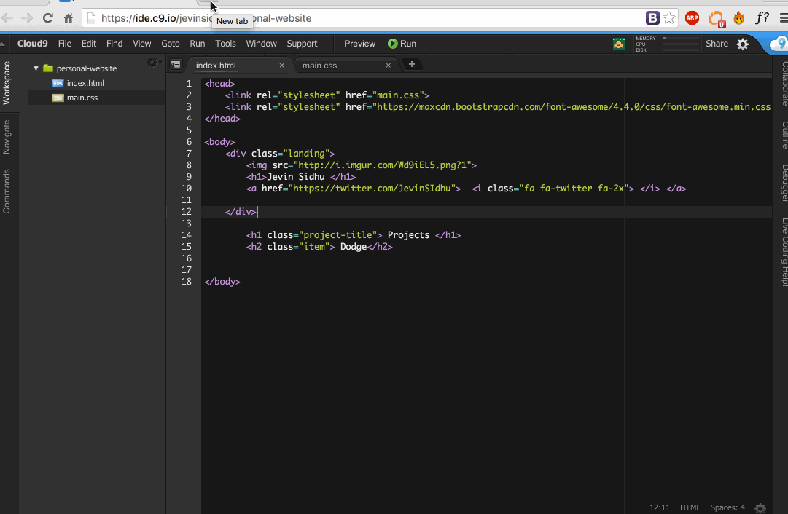

# Google Fonts

*Time Estimate: 10 minutes*

Note: This is an extension to the [Personal Website](README.md) guide -- please complete that first before reading through this.

## Our Goal

This adds custom fonts to your website, rather than using the default font, "Times New Roman".

Link to example website: http://jevinsidhu.github.io/workshop-website/

Link to final code: https://ide.c9.io/jevinsidhu/workshop-website

## Part One: Adding a Google Font

The font is currently "Times New Roman". We'll add custom fonts through Google's platform, Google Fonts. This will change how our text looks.

1. Navigate to https://google.com/fonts
2. Choose a font by clicking the __middle__ icon
3. Fonts have different weights → Choose one or two
- Weights is  a fancy term for the thickness 
- The numbers range from 100 to 700 in hundreds for a total of 7
  - Some fonts only have a few weights, others have all 7
4. Go to the number 3 area where it says “Add this code to your website”
- You’ll notice it looks exactly like linking a CSS file -- that’s because it is!
5. Since it is a CSS file, copy the code & paste between your `<head> </head>` tags, right under your `main.css` file.

## Part Two: Changing the Font Family

Let's head to our `main.css` file to change the font for the entire HTML document.

1. We want this to affect the entire web page → What encloses the entire document? 
- The __`<body>`__ tag does!
2. __font-family: “[NAME OF FONT]”__
- The property __font-family:__ allows you to choose different fonts → The default one: __Times New Roman__
- The value should be the __name of the font in quotation marks__
  - My font’s name was __Open Sans → font-family: “Open Sans”;__

## Part Three: The End

Congrats you’ve finished building the fonts section!

