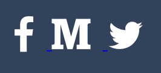
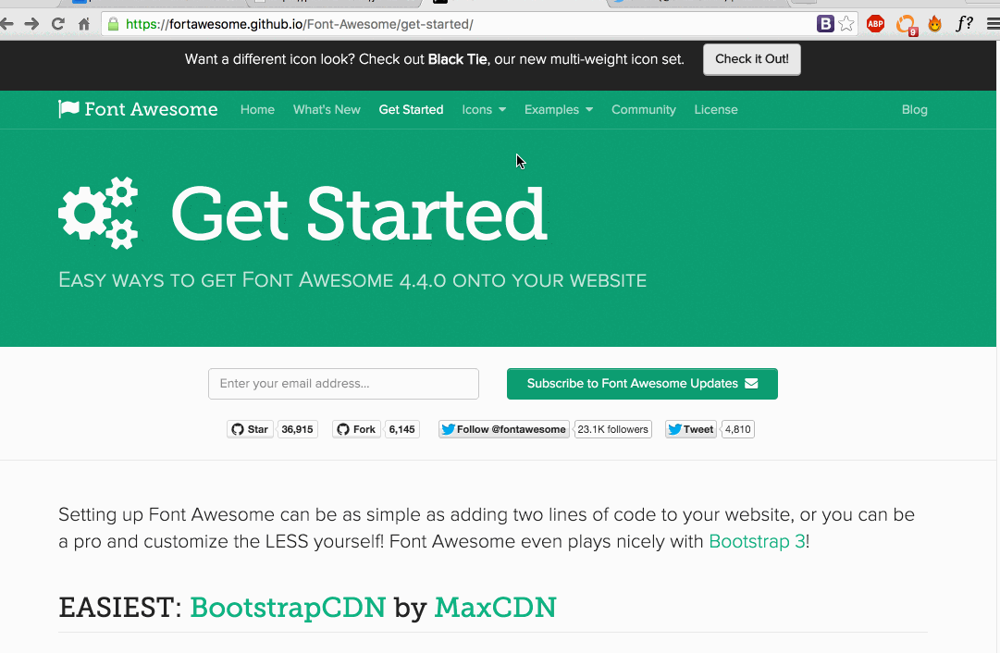
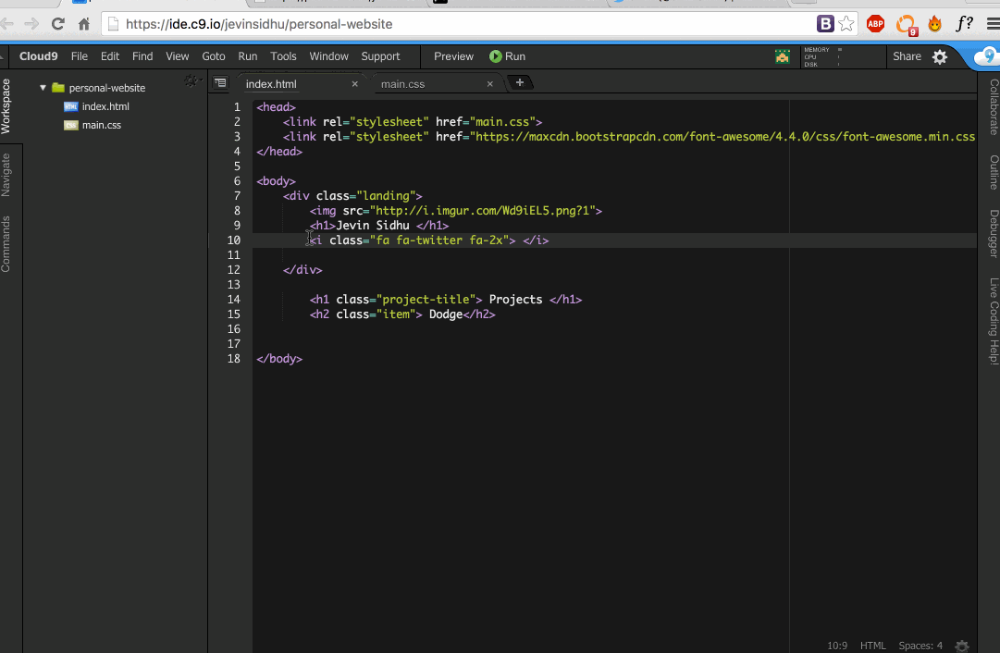

# Icons

*Time Estimate: 15 minutes*

Note: This is an extension to the [Personal Website](README.md) guide -- please complete that first before reading through this.

## Our Goal

This adds social media icons to your website!



Link to example website: http://jevinsidhu.github.io/workshop-website/

Link to final code: https://ide.c9.io/jevinsidhu/workshop-website/

## Part One: Adding Font Awesome

1. Let’s add some social media icons under your name!
 
These are a collection of icons in a __CSS file__

Here is the code:
`<link rel="stylesheet" href="https://maxcdn.bootstrapcdn.com/font-awesome/4.5.0/css/font-awesome.min.css">`

It’s a CSS file, so we paste this in-between the `<head> </head>` like we did with our `main.css` file


## Part Two: Adding the Icon

1. Let’s find a Twitter icon!
 
- Go to the [Font Awesome website](https://fortawesome.github.io/Font-Awesome/icons/). 

- Using the "Search Icons" search bar, enter __“Twitter”__. You’ll find its code is: `fa-twitter`

2. The convention for adding icons is:
  `<i class=”fa [CODE] fa-[SIZE]”> </i>` 
  - To remember it, let's say the `<i>` tag stands for icon
  - `fa` is declaring we are calling an icon from Font Awesome
  - `[CODE]` is where we would put `fa-twitter` for the Twitter icon
  - `fa-[SIZE]` is where you would put your sizing option
    - `fa-2x` is two times bigger than the original icon
    - `fa-3x` is three times bigger

For example: `<i class=”fa fa-twitter fa-2x”> </i>`

3. Put the `<i>` tag right under your name for it to appear under your name
  - Remember: HTML reads from top to bottom
    - This means that if you put objects above or below one another in the code, this is who it will show up when you open the web page



## Part Three: Linking the Icon to Another Web Page

Let’s make it so that when you click the icon, it opens your Twitter profile.

1. Remember: We use the __`<a href=“https://webpage.com”> </a>`__ tag to enclose other tags → This allows us to link to other webpages

For example: 
```
<a href=“https://twitter.com/JevinSidhu”> 
    <i class=”fa fa-twitter fa-2x> </i> 
</a>
```



## Part Four: Icon Styling

1. Open our `main.css` file
2. Using a CSS selector, select the `<a>` tag
- `text-decoration: none;`
  - The text-decoration property specifies the decoration added to text with links
    - By default, the `<a>` tag has some ugly styling -- we are just getting rid of it with the value `none;`
- `color: #fff;`
  - Since this icon pack acts a font, changing the `colour` will change the font color


## Part Five: The End

Congrats you’ve finished building the fonts section!

