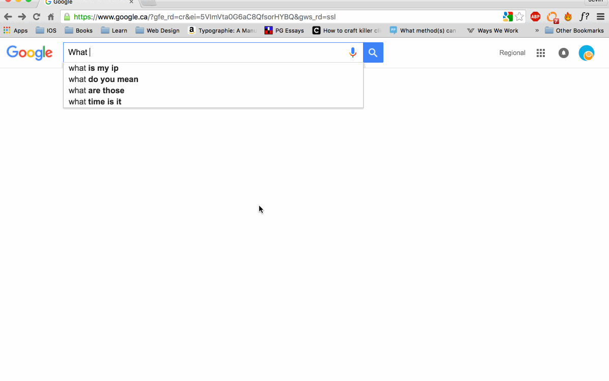
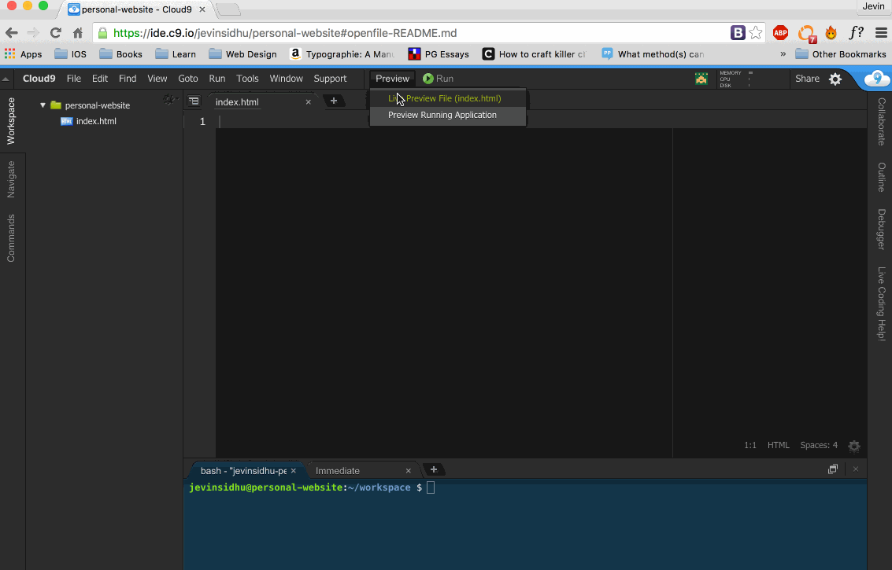

# Personal Website

*Time Estimate: 1 hour*

Notes: 
1. If you have not set up your workspace, please visit the the [Workspace Setup guide](https://github.com/JevinSidhu/cipher/tree/master/guides/workspace_setup).

2. When you see: **[GIF]**, this means the image below is a GIF – a looping video!

## Table of Contents

1. [Part One: Importance of Googling](#)
2. [Part Two: Name of Topic](#)
3. [Part Three: Name of Topic](#)

## Our Goal

By the end of this guide, you will have created a personal website! Though, it doesn't have to be for you. For example, this is [John Cena’s](http://nguyenbrian.github.io/john-cenas-personal-website/) (Turn your sound down!)

Your final design may look similiar to this, but we want you to apply as many changes you as wish!

[//]: <> (Images work on Github, just not on C9 so don't worry about it.)

Link to example: http://jevinsidhu.github.io/workshop-website/

Link to final code: https://ide.c9.io/jevinsidhu/workshop-website

## What You Will Learn

The basics of two programming languages: [HTML](#) and [CSS](#).

## Part One: Importance of Googling

  * What happens when you don’t have a step-by-step tutorial and you need to figure something out?

    * __Google it!__

  * Professional programmers Google while on the job

    * The largest Q&A website for programming (https://stackoverflow.com) __has hundreds of questions submitted by programmers everyday__ who work at tech companies like Apple, Facebook, Google etc.

  * When searching: Be __specific, clear and concise__:

    * Try the first 3 links that appear → Then seek help from friends/co-workers

Google even gives us the answer for our question without having to click anything-- neat! __Try the same for CSS.__

## Part Two: C9.io (Mircosoft Word for Code)

1. Log on to https://c9.io

  * You will arrive at a dashboard with a blue bar to the left

2. Hit the grey box that says __“Create a new workspace”__

3. Fill out the __“Workspace name”__ 
  * Names have no capitals or spaces, this is known as naming conventions
    * Replace a space with a dash (-)

4. Add a short description -- “My personal site!” is a good one!

5. Scroll to the bottom and hit the green “Create workspace” button
  * __Word is a text-editor__ that has __tools that help to write essays, stories, etc.__
  * __C9 is a text-editor__ that has __tools to help you code.__ 
    * The techy term for this is __IDE (integrated development environment)__
  * __C9 also saves all the code online on the cloud similar to Google Drive!__

## Part Three: Setting Up Your Workspace

  * The file that appears is called a markdown file (the extension name .md, like word file is .doc) 
  * Used to format readme files across the web → They have constant look across web browsers
    *These files provide detail to the project

1. We don’t need this file, delete it
    1. __Right click the file, “README.md”,__ from the left bar under “Cloud9” → This is the __directory__ 

  * Click __“Delete”__  on the pop-up menu
  * Click __“Yes”__ on the dialog box to confirm your deletion

## Part Four: Creating Your HTML File

1. Right click the area on the __directory__ (area on the left if you forgot)

2. Click __“New File”__ and name this file __“index.html”__ 
  * Word files end in .doc → HTML files end in .html
    * This ending tells the computer that the document is written in HTML
  * __index.html__ is the usual __name__ for the __main HTML file__
    * In larger projects you may have several files

3. Double click it to open it

## Part Five: Opening the Preview

1. On the bar on the top, right below my bookmark tab or URL area, navigate to the 2nd last tab, __“Preview”__
  * You want to be able to see the changes you make 
    * With Word, as you type you can see your changes instantly (WYSIWYG)
    * With HTML, you need to:
      * Type
      * Save the document
      * View changes on the web
        * You may need to refresh the tab with other IDEs → c9 supports auto-refreshing 
2. Click “Live Preview File”
3. A window on the right side, called a __pane__, will pop up
4. Click the boxed arrow icon on the right of the pane to open the webpage fullscreen

## Part Six: Writing Some Code!
[//]: <> (From this point unordered lists are using - cause I didn't know that worked)
1. Back to the index.html file! __Let’s write your name and a description!__ 
    - I.e. Jevin Sidhu
      - My name is Jevin
    - Your name and description is HTML code!

2. Save the file by clicking __“File”__ on the top-bar and then __Save__ OR using the shortcut __CTRL + S/Command + S__ 

3. Switch to the tab with your “Live Preview” to see your changes!
- You may need to refresh your page because c9 sometimes doesn't auto-refresh in time
- Note: Notice how adding blank lines between your sentences in HTML does not change what it looks like
  - You need to style elements by using __HTML Tags__

## Part Seven: Introducing HTML Tags!

- __HTML tags are used to organize the content of a web page__

1. Put your name as a big “header” by putting it inside a heading tag
- `<h1> Your Name </h1>` 
- This styles your name with bigger, bolder font and puts it on a separate line

`<h1> Jevin Sidhu </h1>` 

- __`<h1>`__ is the __opening__ h1 tag
- __`</h1>`__ is the __closing__ h1 tag → The difference is the forward slash before the name __( / )__

- Almost all HTML tags have both an opening and closing tag → the ones that don’t we will discuss

## Part Eight: More about Headings

- There are __six different tags, h1 through h6__
  - __`<h1>`__ tag indicates that its text is the __most important__ and __`<h6>`__ is the __least important__ 
  - The closer the tag is to __h1 numerically, the larger the text__

## Part Nine: Adding an Image

1. To add an image, use the image tag: 

__``__ 
 - __img__ is the tag name → This is self-closing, meaning there is no __closing tag like `</img>`__ 
 - __src__ is an attribute that specifies the URL of the image
   - Think of it like a setting 
 - Add the URL (redirected to image) between the quotes
 - ``<oven temperature=”350”>``
   - temperature is the name of the attribute
   - 350 is the value of the temperature attribute
- http://imgur.com/ is a website where you can upload and then get a link to the image

2. The webpage __reads HTML top to bottom__, so if you put the __tag above the text, it will show up above__

- If you put the __tag below the text, it will show up below__

## Part Ten: Introducing CSS

- __HTML__ is used for __content__ 
  - Like the __skeleton (sp00ky)__ of a body
- __CSS__ is used to change the way things __look and feel__
  - Like the __colour, width, height__ of your face/skin
- Therefore, if we want to __change the size of the image → Use CSS!__

__Create a CSS file by:__

1. Right clicking the area to the __directory__
2. Click __“New File”__
3. Name it by typing: __main.css__
- The __extension__ acts as an __identifier__ for the computer (just like .doc or .html)
- __main.css__ is __common name__ for the main CSS file
4. Double click to open the file

## Part Eleven: Adding the Head Tag 

1. Let’s hop back to our index.html file by double clicking it
- We need to __tell the web page some information__ about our HTML file!
  - None of this information should show up on the webpage itself
    - I.e. Show up like your name on the page

- To do this: we need to enclose the information in a __`<head>`__ tag
  - Remember to close the tag with closing `</head>` tag → this is __not like the img tag__
    - __c9 closes tags automatically for you__, but you may delete it by accident sometimes

1. Write the tag __`<head>`__ and make sure you have the closing tag __`</head>`__

- __Computers are dumb; they are powerful because humans program them.__
  - We have these two files, the HTML file and the CSS file 
  - The computer draws __no__ association between the two
    - We need to specifically tell them → link these two together so they are connected

## Part Twelve: Linking the CSS file to the HTML

1. Let’s link the HTML and CSS file! You have to add another tag for this.

- The code is: __`<link rel= “stylesheet” href=“FILENAME” >`__ 
  - __link__ is a tag → it’s self-closing, like the __img tag__, so there is no closing tag ( </link> )
    - This lets the webpage know you are linking something
  - __href__ is an attribute, __like the src one for the img tag__, that specifies the location of a file
    - Think of it like a setting 
  - __rel is also an attribute that tells the HTML what sort of file it is linking to__

1. Add the name of the CSS file between the quotes → `<link rel= “stylesheet” href=“main.css”>` 
- Ensure you include the extension: __.css → “main.css”__ NOT “main”

## Part Thirteen: Change the Image Size

1. Let’s hop onto the CSS file → Double click the CSS file on the right directory

2. Before we got side-tracked, we were trying to change the size of our image -- it’s way too big right now 

- Let’s write some code to change that in the “main.css” file:

    img {
      width: 25%;
    }

- Play around with the value → The lower it is, the smaller the image will become!

## Part Fourteen: The Breakdown

Let’s break this down into an English sentence:

- This is called __pseudo-code__ → Code that wouldn’t run on the computer, but we’re making sense of it

 For every __img tag__ on the web page

 I want all the style properties __inside the curly brackets__ to apply:

 specifically, I want __the width__

 to be __50% of the width of the page.__
 
## Part Fifteen: Vocabulary

img is called the selector, it "selects" all of the img tags and applies all of the settings inside of the curly braces

{ } are called __curly braces__

The name on the __left side of the colon__ is called the __"property"__, in this case it is __width.__

__50%__ is what's known as the __"value" → End the property + value declaration with semicolon (;)__. This acts like a period.

## Part 6teen: Pixels versus Percentage

- If you resize the page, the image will adjust to be 25% of the total view.
  - If we want the image to stay a constant size → We need to use a different __value type__ named __pixels__ 

1. Set the __width (property)__ to __200px (value)__ instead of __25% (value)__
- Use __pixels: [number] px__ instead of __[number] %__ → A pixel is a single point in an image and thousands make up one
  - This specifies how big the image should be __no matter the size of the page__
- Remember to __end the value (200px)__ with a __semicolon__ (;) and __close the curly braces ( } )__

## Part Seventeen: Making the Image a Circle

Heading numbers are offset on the doc, so watch out. Follow the numbers on this workspace