# Personal Website

*Time Estimate: 1 hour*

Note: If you have not set up your workspace, please visit the the [Workspace Setup](https://github.com/JevinSidhu/cipher/tree/master/guides/workspace_setup) guide.

## Our Goal

By the end of this guide, you will have created a personal website! 

Though, it doesn't have to be for you. For example, this is [John Cena’s](http://nguyenbrian.github.io/john-cenas-personal-website/) _(Turn your sound down!)_.

Your final product will look similiar to this, but we want you to apply as many changes you as wish:


Link to example website: http://jevinsidhu.github.io/workshop-website/

Link to final code: https://ide.c9.io/jevinsidhu/workshop-website

## What You Will Learn

The basics of two programming languages: [HTML](https://github.com/JevinSidhu/cipher/blob/personal-site/guides/DOCUMENTATION.md#html) and [CSS](https://github.com/JevinSidhu/cipher/blob/personal-site/guides/DOCUMENTATION.md#css).

## Part One: Importance of Googling

What happens when you don’t have a step-by-step tutorial and you need to figure something out?

__Google it!__

Professional programmers Google while on the job. The largest Q&A website for programming (https://stackoverflow.com) __has hundreds of questions submitted by programmers everyday__ who work at giant tech companies like Apple, Facebook and Google.

When searching: Be __specific, clear and concise__. 

Try the first 3 links that appear → Then seek help from friends/co-workers


In the case above, Google even gives us the answer for our question without having to click anything-- neat! __Try the same for CSS.__

## Part Two: Log onto Cloud 9

You should have a Cloud 9 account after following the [Workspace Setup](https://github.com/JevinSidhu/cipher/tree/master/guides/workspace_setup) guide!

1. Head to https://c9.io

2. Open the workspace titled "cipher-projects".

3. It will take a few seconds to load. After it does, you should get a page that looks similiar to this: 

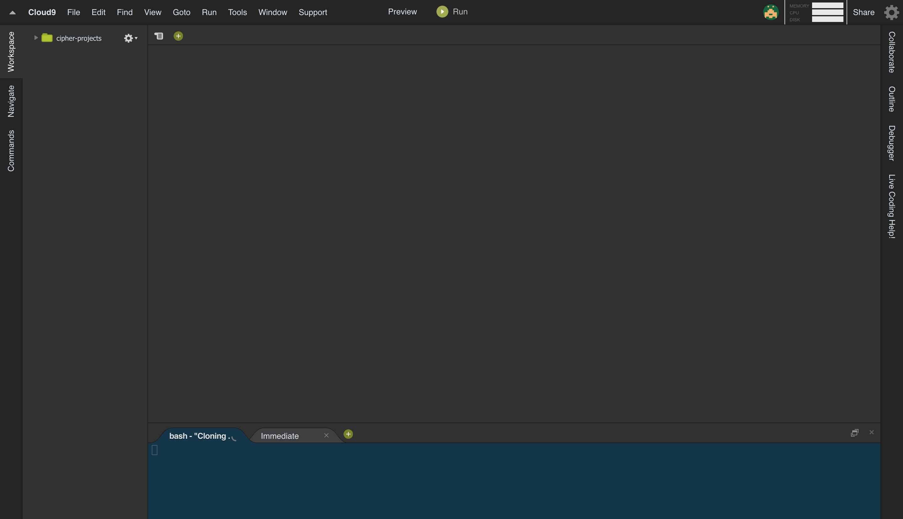

## Part Three: Creating Your HTML File

1. Right click the area on the __directory__ (area on the left if you forgot)

2. Click __“New File”__ and name this file __“index.html”__ 
  * Word files end in .doc → HTML files end in .html
    * This ending tells the computer that the document is written in HTML
  * __index.html__ is the usual __name__ for the __main HTML file__
    * In larger projects you may have several files

3. Double click the file to open it


## Part Four: Opening the Preview

1. On the bar on the top, right below my bookmark tab or URL area, navigate to the 2nd last tab, __“Preview”__
  * You want to be able to see the changes you make 
    * With Word, as you type you can see your changes instantly
    * With HTML, you need to:
      * Type
      * Save the document
      * View changes on the web
        * You may need to refresh the tab with other IDEs → c9 supports auto-refreshing 
2. Click “Live Preview File”
3. A window on the right side, called a __pane__, will pop up
4. Click the boxed arrow icon on the right of the pane to open the webpage fullscreen


## Part Five: Writing Some Code!
1. Back to the index.html file! __Let’s write your name and a description!__ 
    - I.e. Jevin Sidhu
      - My name is Jevin
    - Your name and description is HTML code!

2. Save the file by clicking __“File”__ on the top-bar and then __Save__ OR using the shortcut __CTRL + S/Command + S__ 

3. Switch to the tab with your “Live Preview” to see your changes!
- You may need to refresh your page because c9 sometimes doesn't auto-refresh in time
- Note: Notice how adding blank lines between your sentences in HTML does not change what it looks like
  - You need to style elements by using __HTML Tags__

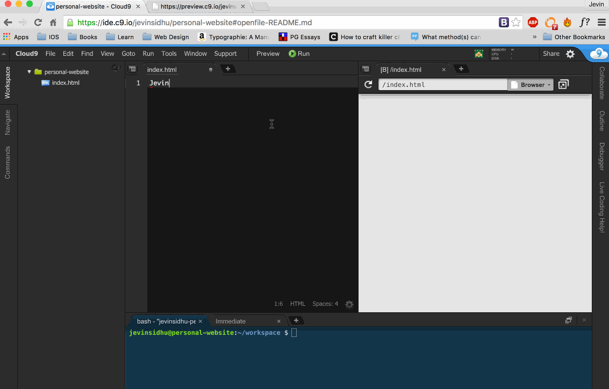

## Part Six: Introducing HTML Tags!

- __HTML tags are used to organize the content of a web page__

1. Put your name as a big “header” by putting it inside a heading tag
- `<h1> Your Name </h1>` 
- This styles your name with bigger, bolder font and puts it on a separate line

`<h1> Jevin Sidhu </h1>` 

- __`<h1>`__ is the __opening__ h1 tag
- __`</h1>`__ is the __closing__ h1 tag → The difference is the forward slash before the name __( / )__

- Almost all HTML tags have both an opening and closing tag → the ones that don’t we will discuss

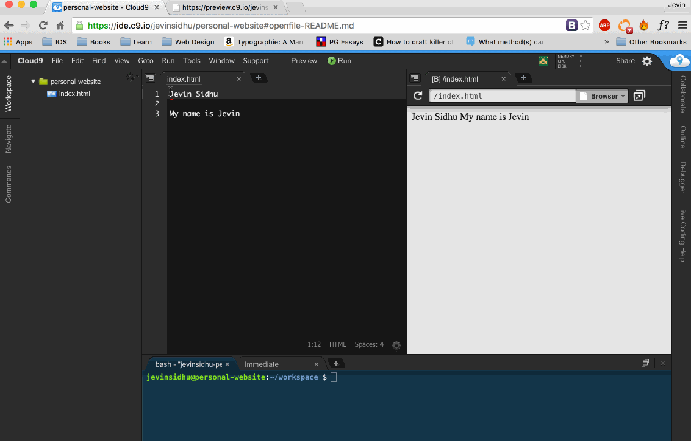

## Part Seven: More about Headings

- There are __six different tags, h1 through h6__
  - __`<h1>`__ tag indicates that its text is the __most important__ and __`<h6>`__ is the __least important__ 
  - The closer the tag is to __h1 numerically, the larger the text__

## Part Eight: Adding an Image


1. To add an image, use the image tag: 

__``__ 
 - __img__ is the tag name → This is self-closing, meaning there is no __closing tag like `</img>`__ 
 - __src__ is an attribute that specifies the URL of the image
   - Think of it like a setting 
 - Add the URL (redirected to image) between the quotes
- http://imgur.com/ is a website where you can upload and then get a link to the image


2. The webpage __reads HTML top to bottom__, so if you put the __tag above the text, it will show up above__

- If you put the __tag below the text, it will show up below__


## Part Nine: Introducing CSS

- __HTML__ is used for __content__ 
  - Like the __skeleton (sp00ky)__ of a body
- __CSS__ is used to change the way things __look and feel__
  - Like the __colour, width, height__ of your face/skin
- Therefore, if we want to __change the size of the image → Use CSS!__

__Create a CSS file by:__

1. Right clicking the area to the __directory__
2. Click __“New File”__
3. Name it by typing: __main.css__
- The __extension__ acts as an __identifier__ for the computer (just like .doc or .html)
- __main.css__ is __common name__ for the main CSS file
4. Double click to open the file

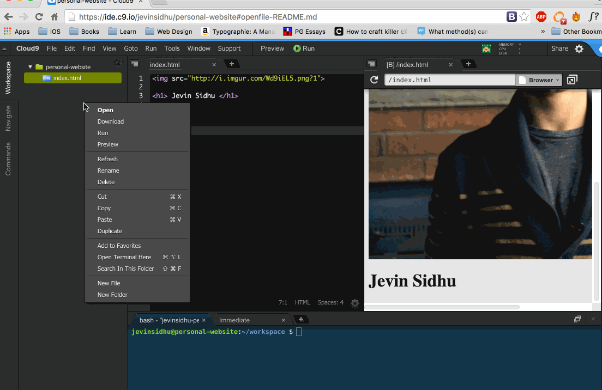

## Part Ten: Adding the Head Tag 

1. Let’s hop back to our index.html file by double clicking it
- We need to __tell the web page some information__ about our HTML file!
  - None of this information should show up on the webpage itself
    - I.e. Show up like your name on the page


- To do this: we need to enclose the information in a __`<head>`__ tag
  - Remember to close the tag with closing `</head>` tag → this is __not like the img tag__
    - __c9 closes tags automatically for you__, but you may delete it by accident sometimes


1. Write the tag __`<head>`__ and make sure you have the closing tag __`</head>`__

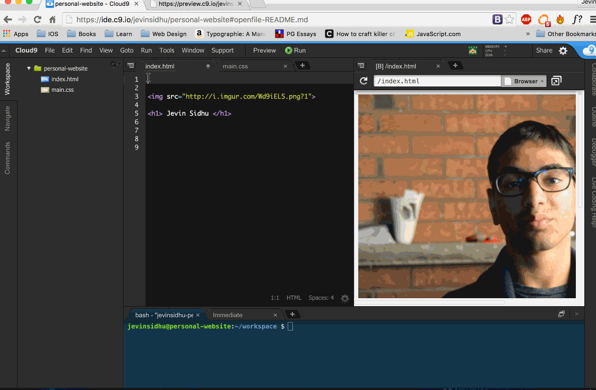

- __Computers are dumb; they are powerful because humans program them.__
  - We have these two files, the HTML file and the CSS file 
  - The computer draws __no__ association between the two
    - We need to specifically tell them → link these two together so they are connected

## Part Eleven: Linking the CSS file to the HTML

1. Let’s link the HTML and CSS file! You have to add another tag for this.


- The code is: __`<link rel= “stylesheet” href=“FILENAME” >`__ 
  - __link__ is a tag → it’s self-closing, like the __img tag__, so there is no closing tag ( </link> )
    - This lets the webpage know you are linking something
  - __href__ is an attribute, __like the src one for the img tag__, that specifies the location of a file
    - Think of it like a setting 
  - __rel is also an attribute that tells the HTML what sort of file it is linking to__

1. Add the name of the CSS file between the quotes → `<link rel= “stylesheet” href=“main.css”>` 
- Ensure you include the extension: __.css → “main.css”__ NOT “main”

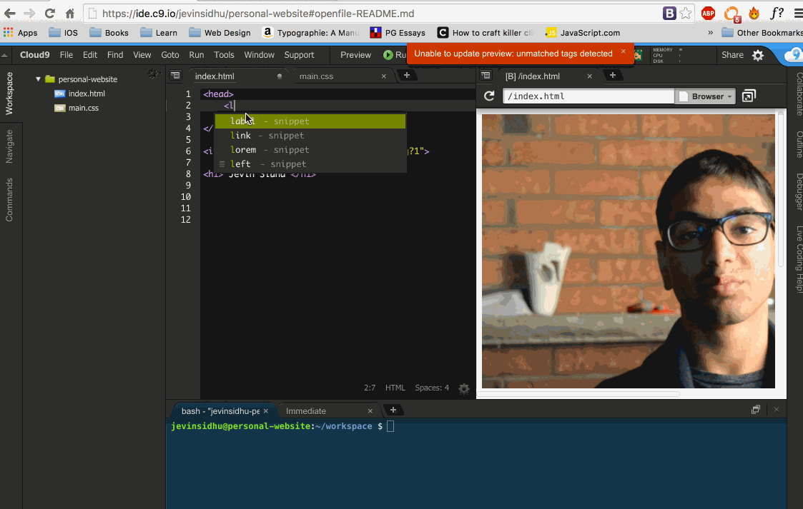

## Part Twelve: Change the Image Size

1. Let’s hop onto the CSS file → Double click the CSS file on the right directory


2. Before we got side-tracked, we were trying to change the size of our image -- it’s way too big right now 


- Let’s write some code to change that in the “main.css” file:

````
    img {
      width: 25%;
    }
````

- Play around with the value → The lower it is, the smaller the image will become!


## Part Thirteen: The Breakdown

Let’s break this down into an English sentence:

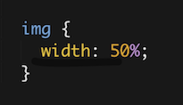


- This is called __pseudo-code__ → Code that wouldn’t run on the computer, but we’re making sense of it


 For every __img tag__ on the web page


 I want all the style properties __inside the curly brackets__ to apply:


 specifically, I want __the width__


 to be __50% of the width of the page.__
 
## Part Fourteen: Vocabulary


img is called the selector, it "selects" all of the img tags and applies all of the settings inside of the curly braces


{ } are called __curly braces__


The name on the __left side of the colon__ is called the __"property"__, in this case it is __width.__


__50%__ is what's known as the __"value" → End the property + value declaration with semicolon (;)__. This acts like a period.

## Part Fifteen: Pixels versus Percentage

- If you resize the page, the image will adjust to be 25% of the total view.
  - If we want the image to stay a constant size → We need to use a different __value type__ named __pixels__ 

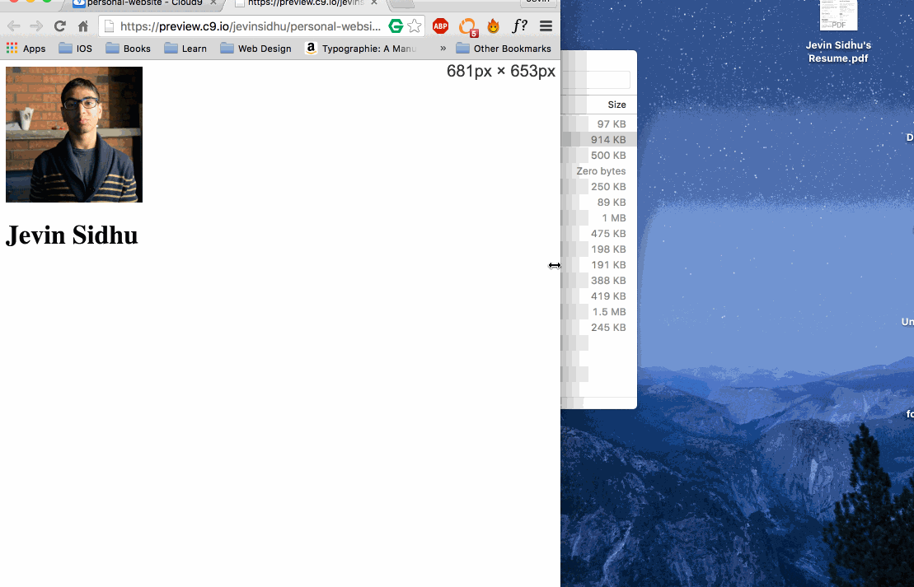

1. Set the __width (property)__ to __200px (value)__ instead of __25% (value)__
- Use __pixels: [number] px__ instead of __[number] %__ → A pixel is a single point in an image and thousands make up one
  - This specifies how big the image should be __no matter the size of the page__
- Remember to __end the value (200px)__ with a __semicolon__ (;) and __close the curly braces ( } )__


## Part 6teen: Making the Image a Circle

- Let’s __Google__ how to make our image a circle! → Remember: Be __specific, clear and concise:__
  - I googled: make image circular in css 
- This was the first one I found, but if yours wasn’t this one -- don’t stress, it’s probably still right!        


1. Add: __border-radius: 50%;__ → have a __line-break between each property and value with the “enter” key__


## Part Seventeen: Making the Image a Circle

1. We need to centre all the objects now → We could use multiple CSS selectors to pick each tag in the HTML

The effective way: Enclose everything in one tag and then use ONE CSS selector to center everything

2. The tag that usually encloses the main document is: __`<body> </body>`__ 
- The `<body>` tag contains all the contents of an HTML document, such as text, hyperlinks, images, tables, lists, etc → __Does not include the `<head>` tag__

3. Let’s make the code more readable
- Indent everything enclosed in the __`<body>` tag:__
  - Highlight by left-clicking and then drag across the text __inside__ of the tag (do not highlight <body>).
- Click the __“tab”__ key on your keyboard
- __Ensure you indent future lines of code inside of the `<body>` tag__


4. __Now try indenting the code inside the `<head>` tag!__

## Part Eighteen: Centre your Image + Text

1. Let’s center your picture and name inside the __`<body>`__ tag
- Open the __main.css__ file 
- Using the previously learned __CSS selector__, select the__`<body>`__ tag
2. __CSS property: text-align__ to control whether our objects are left, center, or right-aligned 
- Kind of like Word again!
- Images are considered “text” in this sense and so the property affects images as well
3. __CSS value: center__ to center the text → there is also __left__ and __right__ to align each way

Unformatted Code: body { text-align: center; } ← __DO NOT COPY & PASTE, YOU WILL FORGET IT QUICKLY__ 


## Part Nineteen: Change your Background Colour

1. Let’s __change that white to another colour!__
2. Within the __CSS body selector__ let’s declare another __CSS property named background-color__
- This does exactly what is sounds like: allows you to change the background color
3. The __CSS value__ for this property __will be a colour__
- __Colours can be the name of the colour__ 
  - I.e. grey, white, black
- __Colour have codes__, known as __hex codes__ → more shades and you need __# before the number__
  - I.e. #808080 = Grey + #000 = Black + #ffff = White 
  - __b&w have only 3 digits, but most are 6 digits long__

Code: background-color: #HEXCODE;

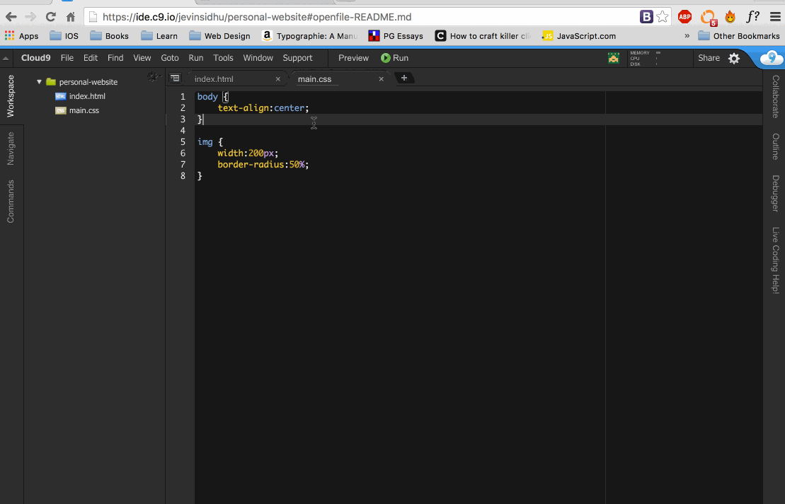

- Check out some beautiful __colours here: http://colorhunt.co/__

## Part Twenty: Color the `<h1>` Tag

1. Let’s change the __color__ of our __`<h1>` heading__ as well
2. Create a __CSS selector__ in your __main.css__ file for `__<h1>__`
- __`h1 { }`__ 
3. Use the __CSS property, color:__ and __CSS value (hex-color) #fff or white;__ to make it white
- This isn’t the __background-color__ of the text, it is simply the __color__ of the font

It should look something like this:

```
h1 { 
    color: #fff; 
}
```


## Part Twenty-One: Intro to Margin & Padding 
Let’s take a second to introduce two new concepts: margin and padding 

- __Margin__ clears an area around an element
  - It’s completely transparent
  - __Top, right, bottom, and left margin__ can be changed independently using separate properties.
- __Padding__ clears an area around the content of an element inside the border
  - It’s affected by the background color of the element.
  - __Top, right, bottom, and left padding__ can be changed independently using separate properties.

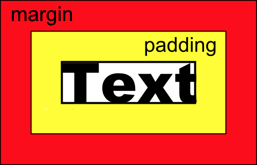

Example: You have a ring  and you’re putting it in a gift bag. The __area around the ring in the bag is padding__, the __area between the bag and your hand is margin.__ 

1. The picture and text are too close to the top of the webpage -- Let’s fix this.
- We need another __CSS property__ called __margin__ and __CSS value: a numerical value (percent or pixels)__
2. Let’s use the img tag → Therefore we must use the __CSS img selector__
- We use the img tag because that is the closest thing to the top
- If we move that, the text under it will move as well 
3. We are using the __margin__ but want to use specifically the __top as the property → margin-top: 250px;__

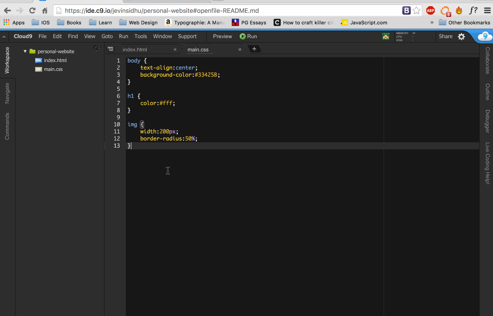

## Part Twenty-Two: The End

Congrats you’ve finished building your website! __This is huge.__

Get it online using this workshop: https://hackpad.com/Basic-Git-and-Github-gOQpi30cvG8

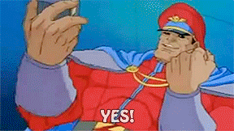

## Further Sections

1. [Project Section](PROJECT_SECTION.md)
2. [Custom Fonts with Google Fonts](GOOGLE_FONTS.md)
3. [Icons](ICONS.md)
4. [Bonus Ideas](BONUS_IDEAS.md)
