# Personal Website

*Time Estimate: 1 hour*

Notes: If you have not set up your workspace, please visit the the [Workspace Setup guide](https://github.com/JevinSidhu/cipher/tree/master/guides/workspace_setup).

When you see: **[GIF]**, this means the image below is a GIF – a looping video!

## Our Goal

By the end of this guide, you will have created a personal website! Though, it doesn't have to be for you. For example, this is [John Cena’s](http://nguyenbrian.github.io/john-cenas-personal-website/) (Turn your sound down!)

Your final design may look similiar to this, but we want you to apply as many changes you as wish!


Link to example: http://jevinsidhu.github.io/workshop-website/

Link to final code: https://ide.c9.io/jevinsidhu/workshop-website

## What You Will Learn

The basics of two programming languages: [HTML](https://github.com/JevinSidhu/cipher/blob/personal-site/guides/DOCUMENTATION.md#html) and [CSS](https://github.com/JevinSidhu/cipher/blob/personal-site/guides/DOCUMENTATION.md#css).

## Part One: Importance of Googling

  * What happens when you don’t have a step-by-step tutorial and you need to figure something out?

    * __Google it!__


  * Professional programmers Google while on the job

    * The largest Q&A website for programming (https://stackoverflow.com) __has hundreds of questions submitted by programmers everyday__ who work at tech companies like Apple, Facebook, Google etc.

  * When searching: Be __specific, clear and concise__:

    * Try the first 3 links that appear → Then seek help from friends/co-workers


Google even gives us the answer for our question without having to click anything-- neat! __Try the same for CSS.__

## Part Two: C9.io (Mircosoft Word for Code)

If you've already made your C9 account & setup your workspace, skip to [Part Four: Creating Your HTML File](#part-four-creating-your-html-file)

1. Log on to https://c9.io

  * You will arrive at a dashboard with a blue bar to the left

2. Hit the grey box that says __“Create a new workspace”__

3. Fill out the __“Workspace name”__ 
  * Names have no capitals or spaces, this is known as naming conventions
    * Replace a space with a dash (-)

4. Add a short description -- “My personal site!” is a good one!

5. Scroll to the bottom and hit the green “Create workspace” button
  * __Word is a text-editor__ that has __tools that help to write essays, stories, etc.__
  * __C9 is a text-editor__ that has __tools to help you code.__ 
    * The techy term for this is __IDE (integrated development environment)__
  * __C9 also saves all the code online on the cloud similar to Google Drive!__

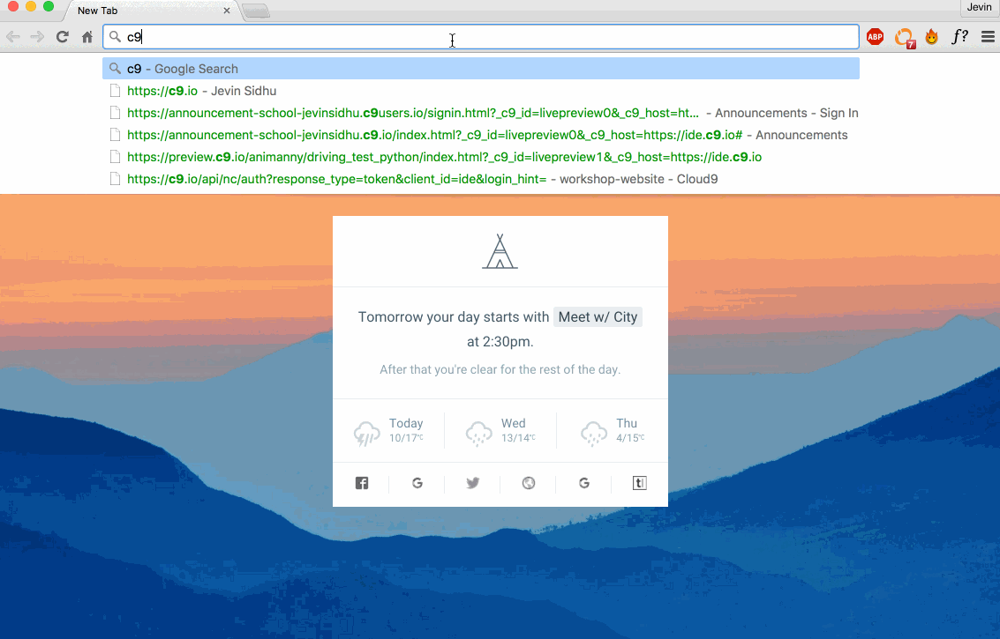

## Part Three: Setting Up Your Workspace


  * The file that appears is called a markdown file (the extension name .md, like word file is .doc) 
  * Used to format readme files across the web → They have constant look across web browsers
    *These files provide detail to the project


1. We don’t need this file, delete it
    1. __Right click the file, “README.md”,__ from the left bar under “Cloud9” → This is the __directory__ 


  * Click __“Delete”__  on the pop-up menu
  * Click __“Yes”__ on the dialog box to confirm your deletion

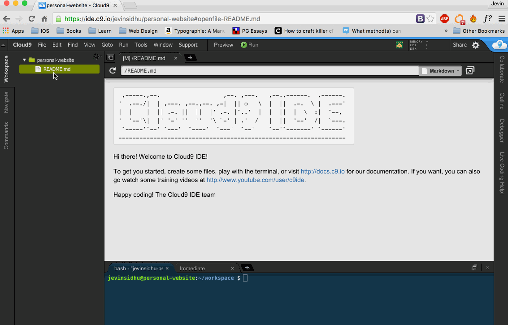

## Part Four: Creating Your HTML File

1. Right click the area on the __directory__ (area on the left if you forgot)

2. Click __“New File”__ and name this file __“index.html”__ 
  * Word files end in .doc → HTML files end in .html
    * This ending tells the computer that the document is written in HTML
  * __index.html__ is the usual __name__ for the __main HTML file__
    * In larger projects you may have several files

3. Double click the file to open it

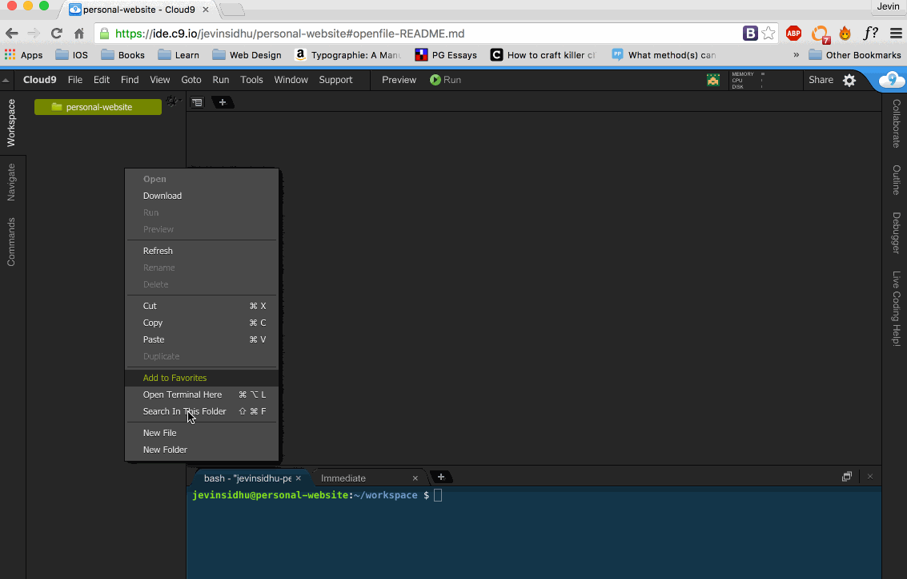

## Part Five: Opening the Preview

1. On the bar on the top, right below my bookmark tab or URL area, navigate to the 2nd last tab, __“Preview”__
  * You want to be able to see the changes you make 
    * With Word, as you type you can see your changes instantly
    * With HTML, you need to:
      * Type
      * Save the document
      * View changes on the web
        * You may need to refresh the tab with other IDEs → c9 supports auto-refreshing 
2. Click “Live Preview File”
3. A window on the right side, called a __pane__, will pop up
4. Click the boxed arrow icon on the right of the pane to open the webpage fullscreen


## Part Six: Writing Some Code!
1. Back to the index.html file! __Let’s write your name and a description!__ 
    - I.e. Jevin Sidhu
      - My name is Jevin
    - Your name and description is HTML code!

2. Save the file by clicking __“File”__ on the top-bar and then __Save__ OR using the shortcut __CTRL + S/Command + S__ 

3. Switch to the tab with your “Live Preview” to see your changes!
- You may need to refresh your page because c9 sometimes doesn't auto-refresh in time
- Note: Notice how adding blank lines between your sentences in HTML does not change what it looks like
  - You need to style elements by using __HTML Tags__


## Part Seven: Introducing HTML Tags!

- __HTML tags are used to organize the content of a web page__

1. Put your name as a big “header” by putting it inside a heading tag
- `<h1> Your Name </h1>` 
- This styles your name with bigger, bolder font and puts it on a separate line

`<h1> Jevin Sidhu </h1>` 

- __`<h1>`__ is the __opening__ h1 tag
- __`</h1>`__ is the __closing__ h1 tag → The difference is the forward slash before the name __( / )__

- Almost all HTML tags have both an opening and closing tag → the ones that don’t we will discuss


## Part Eight: More about Headings

- There are __six different tags, h1 through h6__
  - __`<h1>`__ tag indicates that its text is the __most important__ and __`<h6>`__ is the __least important__ 
  - The closer the tag is to __h1 numerically, the larger the text__

## Part Nine: Adding an Image


1. To add an image, use the image tag: 

__``__ 
 - __img__ is the tag name → This is self-closing, meaning there is no __closing tag like `</img>`__ 
 - __src__ is an attribute that specifies the URL of the image
   - Think of it like a setting 
 - Add the URL (redirected to image) between the quotes
- http://imgur.com/ is a website where you can upload and then get a link to the image

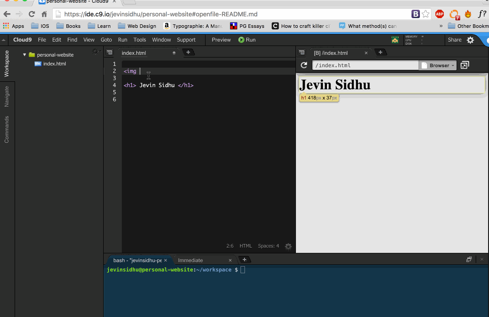

2. The webpage __reads HTML top to bottom__, so if you put the __tag above the text, it will show up above__

- If you put the __tag below the text, it will show up below__


## Part Ten: Introducing CSS

- __HTML__ is used for __content__ 
  - Like the __skeleton (sp00ky)__ of a body
- __CSS__ is used to change the way things __look and feel__
  - Like the __colour, width, height__ of your face/skin
- Therefore, if we want to __change the size of the image → Use CSS!__

__Create a CSS file by:__

1. Right clicking the area to the __directory__
2. Click __“New File”__
3. Name it by typing: __main.css__
- The __extension__ acts as an __identifier__ for the computer (just like .doc or .html)
- __main.css__ is __common name__ for the main CSS file
4. Double click to open the file


## Part Eleven: Adding the Head Tag 

1. Let’s hop back to our index.html file by double clicking it
- We need to __tell the web page some information__ about our HTML file!
  - None of this information should show up on the webpage itself
    - I.e. Show up like your name on the page


- To do this: we need to enclose the information in a __`<head>`__ tag
  - Remember to close the tag with closing `</head>` tag → this is __not like the img tag__
    - __c9 closes tags automatically for you__, but you may delete it by accident sometimes


1. Write the tag __`<head>`__ and make sure you have the closing tag __`</head>`__


- __Computers are dumb; they are powerful because humans program them.__
  - We have these two files, the HTML file and the CSS file 
  - The computer draws __no__ association between the two
    - We need to specifically tell them → link these two together so they are connected

## Part Twelve: Linking the CSS file to the HTML

1. Let’s link the HTML and CSS file! You have to add another tag for this.


- The code is: __`<link rel= “stylesheet” href=“FILENAME” >`__ 
  - __link__ is a tag → it’s self-closing, like the __img tag__, so there is no closing tag ( </link> )
    - This lets the webpage know you are linking something
  - __href__ is an attribute, __like the src one for the img tag__, that specifies the location of a file
    - Think of it like a setting 
  - __rel is also an attribute that tells the HTML what sort of file it is linking to__

1. Add the name of the CSS file between the quotes → `<link rel= “stylesheet” href=“main.css”>` 
- Ensure you include the extension: __.css → “main.css”__ NOT “main”


## Part Thirteen: Change the Image Size

1. Let’s hop onto the CSS file → Double click the CSS file on the right directory


2. Before we got side-tracked, we were trying to change the size of our image -- it’s way too big right now 


- Let’s write some code to change that in the “main.css” file:

````
    img {
      width: 25%;
    }
````

- Play around with the value → The lower it is, the smaller the image will become!

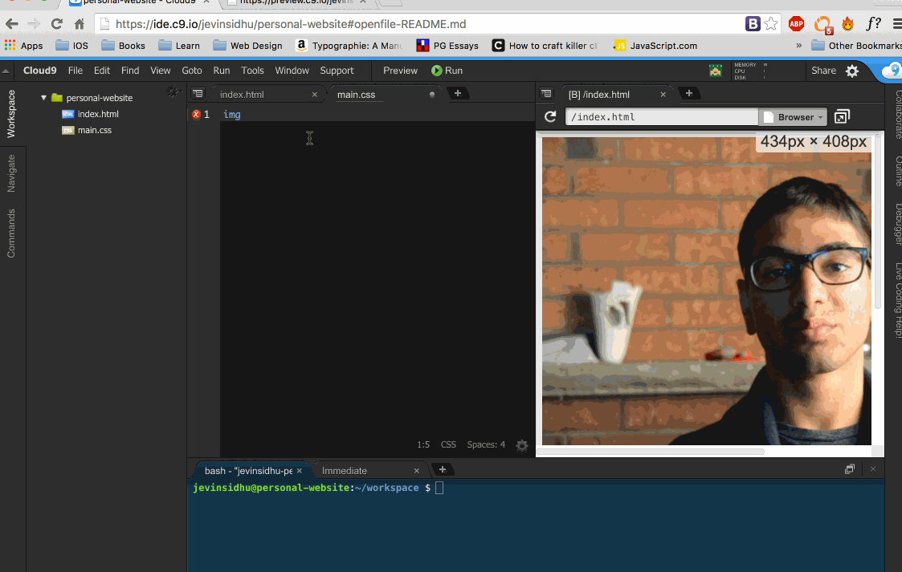

## Part Fourteen: The Breakdown

Let’s break this down into an English sentence:


- This is called __pseudo-code__ → Code that wouldn’t run on the computer, but we’re making sense of it


 For every __img tag__ on the web page


 I want all the style properties __inside the curly brackets__ to apply:

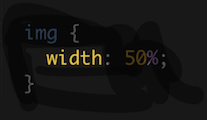


 specifically, I want __the width__


 to be __50% of the width of the page.__
 
## Part Fifteen: Vocabulary


img is called the selector, it "selects" all of the img tags and applies all of the settings inside of the curly braces


{ } are called __curly braces__


The name on the __left side of the colon__ is called the __"property"__, in this case it is __width.__


__50%__ is what's known as the __"value" → End the property + value declaration with semicolon (;)__. This acts like a period.

## Part 6teen: Pixels versus Percentage

- If you resize the page, the image will adjust to be 25% of the total view.
  - If we want the image to stay a constant size → We need to use a different __value type__ named __pixels__ 


1. Set the __width (property)__ to __200px (value)__ instead of __25% (value)__
- Use __pixels: [number] px__ instead of __[number] %__ → A pixel is a single point in an image and thousands make up one
  - This specifies how big the image should be __no matter the size of the page__
- Remember to __end the value (200px)__ with a __semicolon__ (;) and __close the curly braces ( } )__

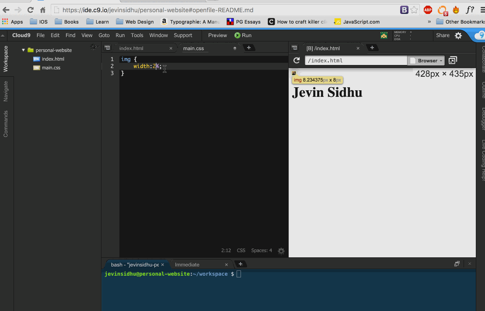

## Part Seventeen: Making the Image a Circle

- Let’s __Google__ how to make our image a circle! → Remember: Be __specific, clear and concise:__
  - I googled: make image circular in css 
- This was the first one I found, but if yours wasn’t this one -- don’t stress, it’s probably still right!        

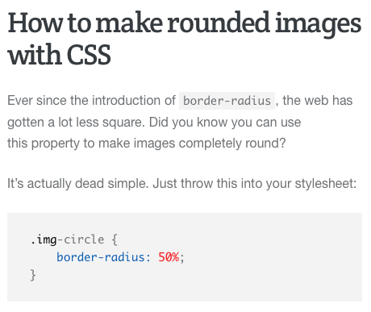


1. Add: __border-radius: 50%;__ → have a __line-break between each property and value with the “enter” key__

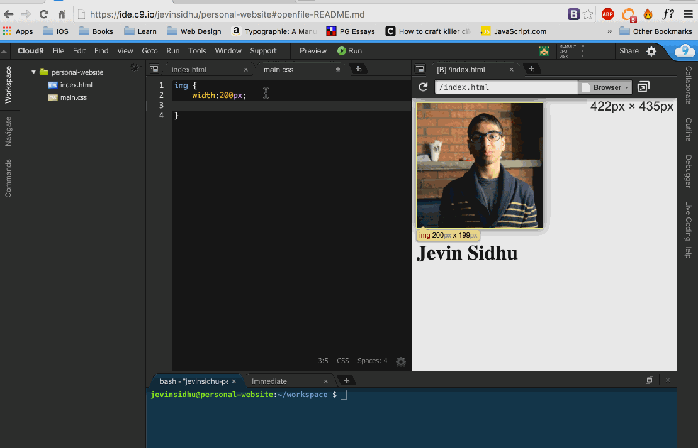

## Part Eighteen: Making the Image a Circle

1. We need to centre all the objects now → We could use multiple CSS selectors to pick each tag in the HTML

The effective way: Enclose everything in one tag and then use ONE CSS selector to center everything

2. The tag that usually encloses the main document is: __`<body> </body>`__ 
- The `<body>` tag contains all the contents of an HTML document, such as text, hyperlinks, images, tables, lists, etc → __Does not include the `<head>` tag__

3. Let’s make the code more readable
- Indent everything enclosed in the __`<body>` tag:__
  - Highlight by left-clicking and then drag across the text __inside__ of the tag (do not highlight <body>).
- Click the __“tab”__ key on your keyboard
- __Ensure you indent future lines of code inside of the `<body>` tag__


4. __Now try indenting the code inside the `<head>` tag!__

## Part Nineteen: Centre your Image + Text

1. Let’s center your picture and name inside the __`<body>`__ tag
- Open the __main.css__ file 
- Using the previously learned __CSS selector__, select the__`<body>`__ tag
2. __CSS property: text-align__ to control whether our objects are left, center, or right-aligned 
- Kind of like Word again!
- Images are considered “text” in this sense and so the property affects images as well
3. __CSS value: center__ to center the text → there is also __left__ and __right__ to align each way

Unformatted Code: body { text-align: center; } ← __DO NOT COPY & PASTE, YOU WILL FORGET IT QUICKLY__ 

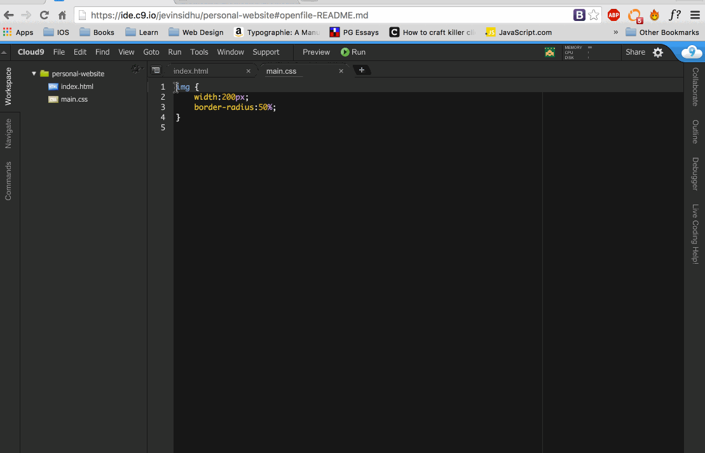

## Part Twenty: Change your Background Colour

1. Let’s __change that white to another colour!__
2. Within the __CSS body selector__ let’s declare another __CSS property named background-color__
- This does exactly what is sounds like: allows you to change the background color
3. The __CSS value__ for this property __will be a colour__
- __Colours can be the name of the colour__ 
  - I.e. grey, white, black
- __Colour have codes__, known as __hex codes__ → more shades and you need __# before the number__
  - I.e. #808080 = Grey + #000 = Black + #ffff = White 
  - __b&w have only 3 digits, but most are 6 digits long__

Code: background-color: #HEXCODE;


- Check out some beautiful __colours here: http://colorhunt.co/__

## Part Twenty-One: Color the `<h1>` Tag

1. Let’s change the __color__ of our __`<h1>` heading__ as well
2. Create a __CSS selector__ in your __main.css__ file for `__<h1>__`
- __`h1 { }`__ 
3. Use the __CSS property, color:__ and __CSS value (hex-color) #fff or white;__ to make it white
- This isn’t the __background-color__ of the text, it is simply the __color__

Unformatted code: `h1 { color: #fff; }`

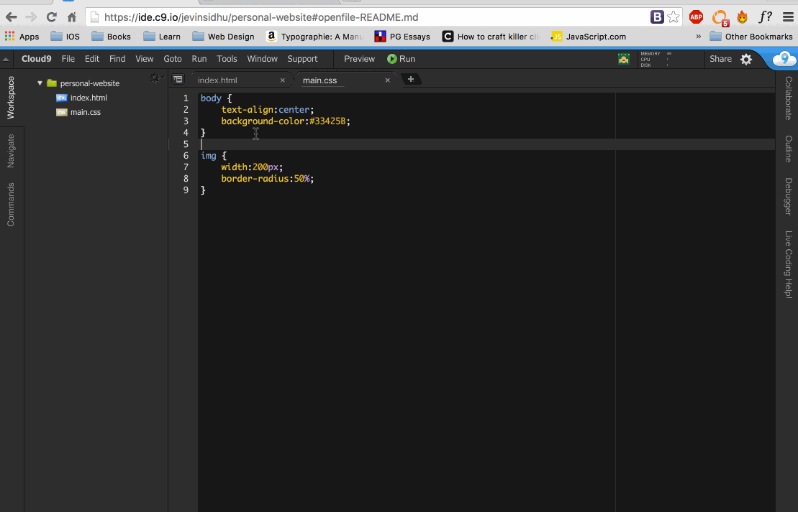

## Part Twenty-Two: Intro to Margin & Padding 
Let’s take a second to introduce two new concepts: margin and padding 

- __Margin__ clears an area around an element
  - It’s completely transparent
  - __Top, right, bottom, and left margin__ can be changed independently using separate properties.
- __Padding__ clears an area around the content of an element inside the border
  - It’s affected by the background color of the element.
  - __Top, right, bottom, and left padding__ can be changed independently using separate properties.


Example: You have a ring  and you’re putting it in a gift bag. The __area around the ring in the bag is padding__, the __area between the bag and your hand is margin.__ 

1. The picture and text are too close to the top of the webpage -- Let’s fix this.
- We need another __CSS property__ called __margin__ and __CSS value: a numerical value (percent or pixels)__
2. Let’s use the img tag → Therefore we must use the __CSS img selector__
- We use the img tag because that is the closest thing to the top
- If we move that, the text under it will move as well 
3. We are using the __margin__ but want to use specifically the __top as the property → margin-top: 250px;__


## Part Twenty-Three: Intro to Divs and Classes

1. Let’s hop back to our __index.html__ file for a little bit!
- We want to start to structure this document for our upcoming __project section__ 
2. We used __`<body>`__  tags to enclose all of our document, but we want to __divide that even further__ to outline a __landing section__ (your picture and name) and a __project section__
- The __`<div> </div>`__ tag defines a division or a section in an HTML document
3. In the CSS, we have been using __CSS selectors to select tags__
- What if you want to __call 1 of your 2 `<h1>` tags__ in your HTML → Both have the same selector right now.
  - To solve this and create __custom CSS selectors__, in HTML → This is called creating a __class__
- After __keyword__ (<div, <body, <h1, <head) of __any tag__, type __class=”class-name”__ to create a class
  - __`<div class=class-name”> </div>`__ 
  - These must no capitals and spaces are replaced by dashes 
4. __Create this div__ and name the class __“landing”__  and enclose the entire content inside of __`<body> </body>`__ 
- It is important to create names that make sense for the future for you to read and understand your code

`<div class=”landing”> |ALL CONTENT| </div>` 


## Part Twenty-Four: Starting the Project Section

- Let’s start the project section with a __`<h1>` header tag__
  - This is the __same one we used for our name__
1. Create the `<h1> Projects </h1>` header tag 
  - Remember that the text inside the tags will be displayed to the page
2. Let’s __add a class__ to the tag, so we can do some special things in __CSS with its selector__
  - Remember: __class=”class-name”__ just after you open the `<h1>` tag
    - __`<h1 class=”project-title”>  Projects </h1>`__ 
      - I named the class “project-title” → descriptive and short, but __spaces must be dashes (-)__

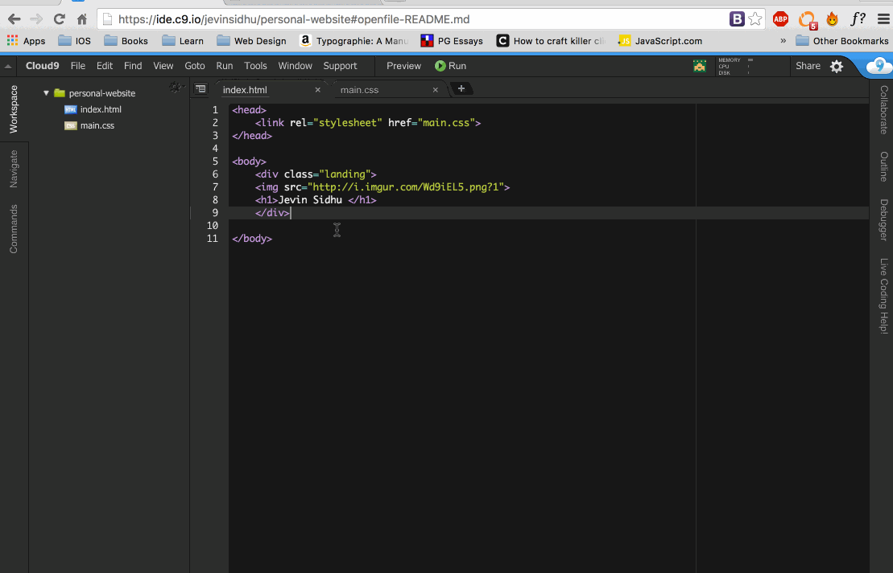

## Part [Twenty-Fiveeeee](https://www.youtube.com/watch?v=nX6N2tgLmaQ): h1 Class Styling

1. Head back to your __CSS__ and let’s style this h1 tag that has the __class “project-title”__
2. To __select the class__, you must __write a period (.) before__ the __class name__ 
- This lets the code know that this is a class and not a tag like `<body>` or `<h1>` or `` 
3. We’ve aligned text into the center before → __Let’s left align it.__
- Look at your previous code written to center your body → use the same but replace “center” with “left”
- This code overwrites the center aligning from the __CSS body selector__  because it is lower on the document remember the computer reads __HTML and CSS run top to bottom__ 


- Kind of like our photo with the top of the webpage, __“Projects” is too close to the left side of the webpage__
  - We __fixed that with margin-top last time__ → This time let's use __margin-left__
- __Look at your past code with margin-top → Copy & Change -top to -left and a value of 250px is solid__
  - Feel free to play around with the value to see what look good to you

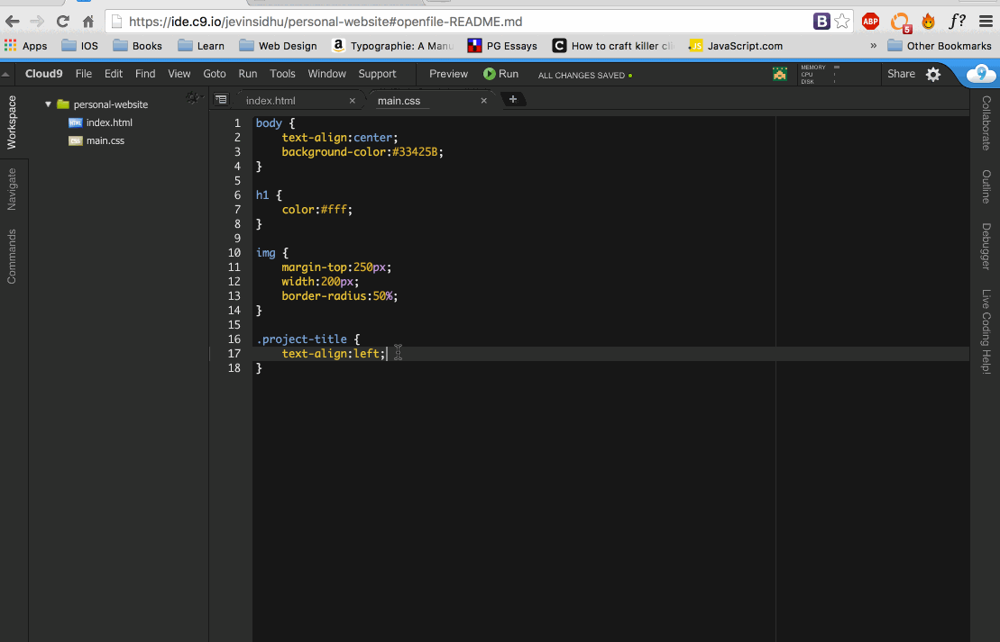

## Part Twenty-Six: Creating the Projects / Items 

1. Let’s add some content below the title!
  - Create a __`<h2>`__ header, which are just smaller `<h1>` headers --  __Step Nine for more info on headers__
2. We’ll give them a __class__ name using __class=”item”__ just before the closing of `<h2>` 
  - Feel free to name this whatever you want, but __“item”__ just makes sense for me + future-me
3. Let’s put the text down as __Dodge__ because that’s a future project you will build
  - There is no need for quotes around the words inside the tags

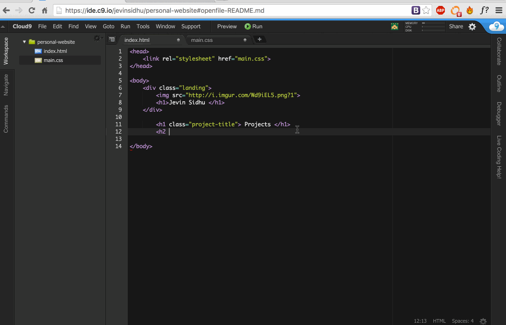

## Part Twenty-Seven: Styling the h2 Tags/Items 

We can use a lot of the knowledge we’ve learned to finish this last part! Let’s tackle it with a list of things to do.
__Head to your main.css file:__

1. Let’s change the __text-color__ by using the __color property__ and a __value__ (i.e. #fff) 
2. Let’s change the __background-color__ by using the __background-color property__ and a __value__ (i.e. #000) 
3. Use __display: inline-block;__ to allow the items to be beside each other, but stack on top of one another for smaller screen sizes.
- We want to make a row of these “items” and continue to add to it as time goes on 
  - __display__ is a property that specifies how the area around the object is effected
  - __inline-block_ is a value that will allow us to put the objects beside each out, but when we get smaller displays (resizing the window), the objects will stack on-top of each other
    - An example of an __block element is a `<h1>`__ header
    - __Inline elements are beside each other__
4. Use __padding,__ which we discussed has background-color unlike margin, to create a button-look
- _Padding adds space inside the border of the text, but margin adds space outside of it
- We can use a shorthand instead of putting padding top, right, bottom and left
- __padding: 100px 150px 100px 150px;__ will __add padding clockwise__ → the 1st number is top, 2nd is right, 3rd is bottom, and 4th is left
- Even shorter is __padding: 100px 150px;__
  - The x and y axis will repeat -- __100px is the x axis__ and __150px is the y axis__


## Part Twenty-Eight: Linking the Items

1. Let’s make it so that when you click one of our projects, it can link to a different page!
- __`<a href=“https://webpage.com”> </a>`__ tag __encloses other tags__ → linking to other webpages
- Between <a href=“https://webpage.com”> __and__ </a> you put your other element
2. Let’s enclose our item so it can link somewhere
- We are going to use an __hashtag (#)__ insert of an URL for now
  - This simply links to the same page we are on --  since we haven’t created these projects this is kind of like a __variable in math__
- `<a href=”#”>  <h1 class=”item”> Dodge </h2> </a>` 

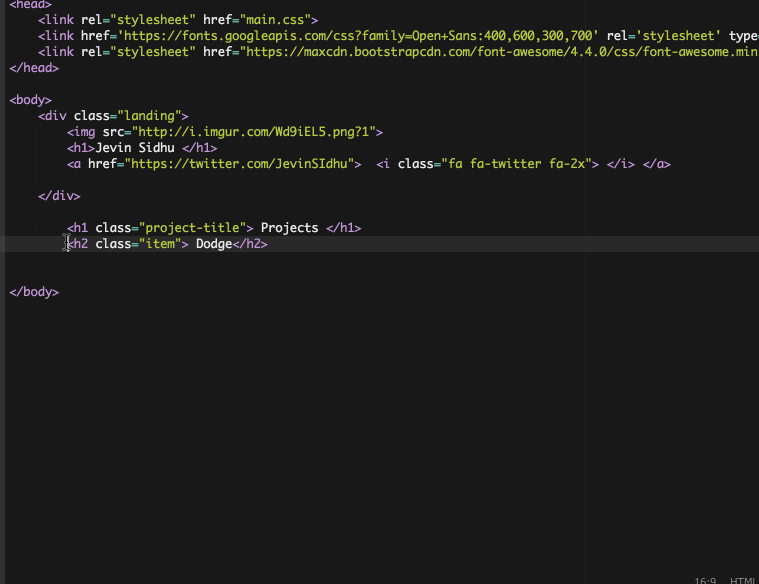

## Part Twenty-Nine: Adding Font Awesome

1. Let’s add some social media icons under your name!
- Icons can be found easily at https://fortawesome.github.io/Font-Awesome/get-started/
  - These are a collection of icons in a __CSS file__
- Because it’s a CSS file, we can link it in the __<head>__ like we did our main.css file
2. Let’s link the file via the online resource they give on their site (click that link above)
- Copy and paste the code from the first step into your head 
  - This is exactly like linking your main.css file, but instead of a local file, it is online


## Part Thirty: Adding the Icon

1. Let’s find a Twitter icon:
  - Go back to the Font Awesome website and __click “Icons”__
  - Search for __“Twitter”__ and you’ll find its code is: __“fa-twitter”__
2. The convention for adding icons is:
  __`<i class=”fa [CODE] fa-[SIZE]”> </i>`__ 
  - __<i> tag stands for icon (kind of, it’s only to think of it like that)__
  - __fa is declaring we are calling an icon from Font Awesome__
  - __[CODE] is where we would put “fa-twitter” for the Twitter icon__
  - __fa-[SIZE] is where you would put your sizing option__
    - __fa-2x__ is two times bigger than the original icon
    - __fa-3x__ is three times bigger

E.g. `<i class=”fa fa-twitter fa-2x”> </i>`

3. Put this __`<i>` tag right under your name__ for it to appear under your name
  - Remember: HTML reads from top to bottom
    - This means that if you put objects above or below one another in the code, this is who it will show up when you open the web page


## Part Thirty-One: Linking the Icon to Another Web Page

- When you click the Twitter icon, let’s make it open the Twitter page
1. Remember: We use the __`<a href=“https://webpage.com”> </a>`__ tag to enclose other tags → This allows us to link to other webpages

`<a href=“https://twitter.com/JevinSidhu”> <i class=”fa fa-twitter fa-2x> </i> </a>` 


## Part Thirty-Two: Icon Styling

- __Head your main.css file__
1. __Using a CSS selector, select the `<a>` tag__
- __text-decoration: none;__
  - The text-decoration property specifies the decoration added to text with links
    - By default, the `<a>` tag has some ugly styling -- we are just getting rid of it with __none;__
- __color: #fff;__
  - Since this icon pack acts a font, changing the colour just like text will change its color

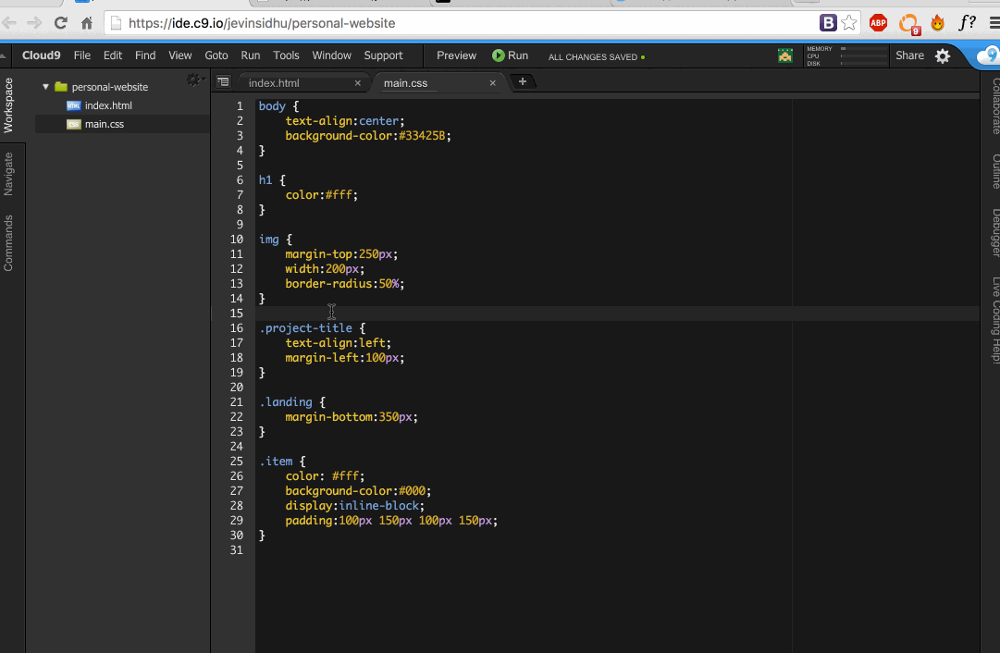

## Part Thirty-Three: Adding a Google Font

Let’s add some custom fonts because default ones are fairly standard

1. Navigate to __google.com/fonts__
2. Choose a font by clicking the __middle__ icon
- You can see more of the font details by clicking the __1st__ button → Scroll to go click the middle icon
3. Fonts have different weights → Choose a few
- This is just a fancy term for the thickness 
- The numbers range from 100 to 700 in hundreds for a total of 7
  - Some fonts only have a few weights, others have all 7
4. Go to the number 3 area where it says “Add this code to your website”
- You’ll notice it looks exactly like a CSS file -- that’s because it is!
5. Since it’s a CSS file, you know what that means! Copy the code & paste in your head


## Part Thirty-Four: Changing Fonts

- Now that you’ve added the font, let’s head to your CSS to change the font for your entire HTML document!
1. We want this to affect the entire web page → What encloses the entire document? 
- The __`<body>`__ tag -- you got it!
2. __font-family: “[NAME OF FONT]”__
- The property __font-family:__ allows you to choose different fonts → The default one: __Times New Roman__
- The value should be the __name of the font in quotation marks__
  - My font’s name was __Open Sans → font-family: “Open Sans”;__

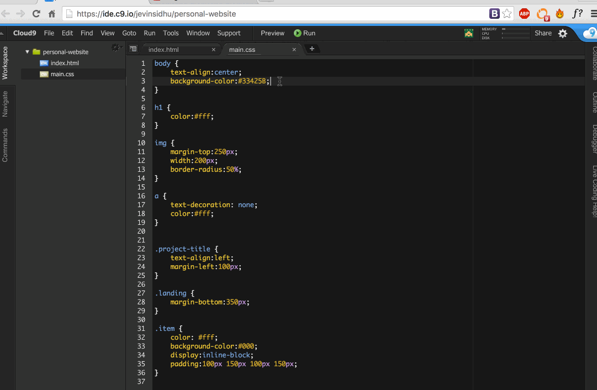

## Part Thirty-Five: The End

Congrats you’ve finished building your website! __This is huge.__

Get it online using this workshop: https://hackpad.com/Basic-Git-and-Github-gOQpi30cvG8


## Bonus Challenges

- Add __more social media icons__ (Facebook, Instagram, etc)
  - Put some __margin-right__ on the __`<a>` tag__ so they each icon has some space to the right of it
    - Otherwise the icons would be very close together!
- Add __more project items/boxes__
  - Simply copy and paste the code of the boxes several times over
- Try to change the __background-colour__ of your project items/boxes and social media icons when you __hover__
  - We learned how to Google like pros -- try to figure it out! 
    - Hint: Pseudo-classes
- Add some __music__ up-in-here
  - Googling pros, let’s get it.
    - Hint: `<audio>` tag
